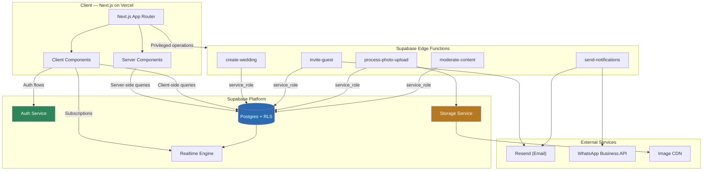
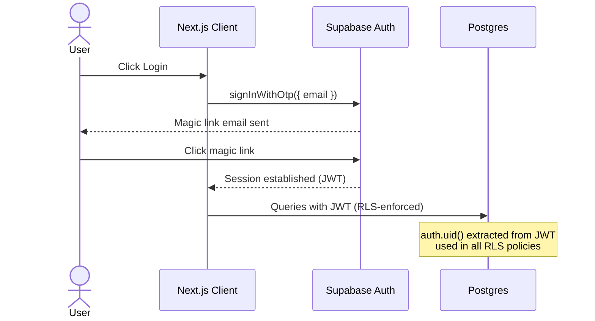
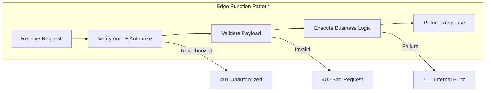
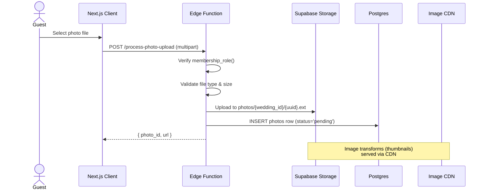
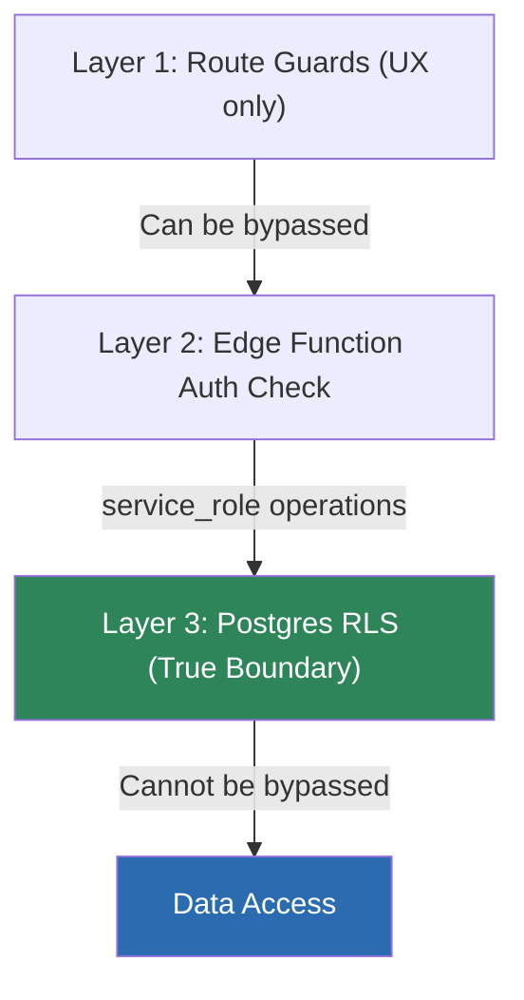
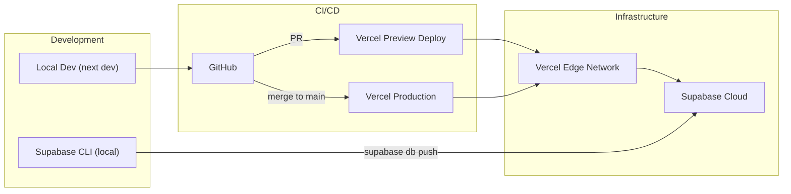

# Aisle — Backend Architecture

## Overview

Aisle uses a **serverless backend** built entirely on the **Supabase platform**, with **Supabase Edge Functions** handling privileged operations. The backend is designed around multi-tenant isolation using **Postgres Row-Level Security (RLS)**.

---

## Architecture Diagram



---

## Core Services

### 1. Supabase Auth

Handles all authentication. No custom auth implementation needed.

| Feature | Implementation |
|---|---|
| **Email/Password** | Standard sign-up and login |
| **Magic Link** | Passwordless login for guests (primary method) |
| **OTP** | Email-based one-time passwords |
| **OAuth** | Optional Google OAuth for convenience |
| **Session Management** | JWT-based, auto-refreshed by Supabase client |

#### Auth Flow



#### JWT Claims

The Supabase JWT contains `auth.uid()` which is used by RLS policies. Role information is resolved at query time by joining `wedding_memberships` — it is **not** embedded in the JWT to avoid stale role data.

---

### 2. Postgres Database

The core data store with RLS as the security boundary.

#### Multi-Tenancy Strategy

```
┌──────────────────────────────────────────────┐
│              Shared Postgres DB              │
│                                              │
│  ┌─────────┐  ┌─────────┐  ┌─────────┐     │
│  │Wedding A│  │Wedding B│  │Wedding C│ ... │
│  │  (RLS)  │  │  (RLS)  │  │  (RLS)  │     │
│  └─────────┘  └─────────┘  └─────────┘     │
│                                              │
│  All tables share the same schema.           │
│  wedding_id + RLS = tenant isolation.        │
└──────────────────────────────────────────────┘
```

**Why this approach:**

| Alternative | Why Rejected |
|---|---|
| Schema-per-tenant | Hundreds/thousands of schemas → migrations unmanageable |
| Database-per-tenant | Massive operational overhead for low-data-volume tenants |
| **Shared schema + RLS** ✅ | Native Supabase support, single migration path, admin cross-tenant queries simple |

#### Key Design Decisions

1. **RLS is the real security boundary**, not application-level guards.
2. **`wedding_id` FK on every tenant-scoped table** — no exceptions.
3. **Helper functions** (`membership_role()`, `is_platform_admin()`) centralize access logic.
4. **`SECURITY DEFINER`** on helper functions ensures they run with the function owner's privileges, not the caller's.

---

### 3. Edge Functions

Supabase Edge Functions (Deno/TypeScript) handle operations requiring **service-role privileges** — things the client should never do directly.

#### Function Catalog

| Function | Trigger | Purpose | Key Operations |
|---|---|---|---|
| `create-wedding` | Admin submits wizard | Creates a wedding with all associated data | INSERT weddings, memberships, love_story, venue, details |
| `invite-guest` | Moderator sends invite | Generates invite token, sends email | INSERT invites, call email provider |
| `process-photo-upload` | Guest uploads photo | Validates membership, stores photo, creates DB row | Storage upload, INSERT photos |
| `moderate-content` | Moderator approves/rejects | Updates content status, logs action | UPDATE photos/notes status, INSERT activity_log |
| `send-notifications` | Various triggers | Sends email/WhatsApp notifications | Call Resend/WhatsApp Business APIs |

#### Edge Function Architecture



#### Example: `create-wedding` Edge Function

```typescript
// supabase/functions/create-wedding/index.ts
import { serve } from 'https://deno.land/std/http/server.ts'
import { createClient } from 'https://esm.sh/@supabase/supabase-js'

serve(async (req) => {
  // 1. Verify caller is platform admin
  const authHeader = req.headers.get('Authorization')!
  const supabaseUser = createClient(URL, ANON_KEY, {
    global: { headers: { Authorization: authHeader } }
  })

  const { data: { user } } = await supabaseUser.auth.getUser()
  if (!user) return new Response('Unauthorized', { status: 401 })

  // 2. Use service_role client for privileged operations
  const supabaseAdmin = createClient(URL, SERVICE_ROLE_KEY)

  // 3. Verify admin status
  const { data: profile } = await supabaseAdmin
    .from('profiles')
    .select('is_platform_admin')
    .eq('id', user.id)
    .single()

  if (!profile?.is_platform_admin) {
    return new Response('Forbidden', { status: 403 })
  }

  // 4. Create wedding + associated data (transactional via RPC)
  const payload = await req.json()
  // ... INSERT operations ...

  return new Response(JSON.stringify({ wedding_id, slug }), {
    headers: { 'Content-Type': 'application/json' }
  })
})
```

---

### 4. Supabase Storage

Handles all file uploads (primarily wedding photos).

#### Bucket Structure

```
wedding-photos (bucket)
├── {wedding_id_1}/
│   ├── {photo_uuid_1}.jpg
│   ├── {photo_uuid_2}.jpg
│   └── thumbs/
│       ├── {photo_uuid_1}_thumb.jpg
│       └── {photo_uuid_2}_thumb.jpg
├── {wedding_id_2}/
│   └── ...
└── ...
```

#### Upload Flow



#### Storage Policies

- **Read**: Members of the wedding can read files under their `wedding_id/` prefix.
- **Write**: Members can upload to their `wedding_id/` prefix (validated server-side).
- **Delete**: Moderators can delete any file; attendees can delete only their own.

---

### 5. Supabase Realtime

Powers live updates for the photo gallery and guestbook without polling.

#### Subscriptions

```typescript
// Client-side Realtime subscription
const channel = supabase
  .channel(`wedding-${weddingId}`)
  .on(
    'postgres_changes',
    {
      event: 'INSERT',
      schema: 'public',
      table: 'photos',
      filter: `wedding_id=eq.${weddingId}`,
    },
    (payload) => {
      // Add new photo to gallery in real-time
      addPhotoToGallery(payload.new)
    }
  )
  .on(
    'postgres_changes',
    {
      event: 'INSERT',
      schema: 'public',
      table: 'notes',
      filter: `wedding_id=eq.${weddingId}`,
    },
    (payload) => {
      // Add new note to guestbook in real-time
      addNoteToGuestbook(payload.new)
    }
  )
  .subscribe()
```

#### Realtime Events

| Table | Event | Consumer | Behavior |
|---|---|---|---|
| `photos` | INSERT | Gallery page | New photo appears live |
| `photos` | UPDATE | Gallery page | Status change (approved/hidden) reflected |
| `notes` | INSERT | Guestbook page | New note appears live |
| `notes` | UPDATE | Guestbook page | Status change reflected |
| `photos` | INSERT/UPDATE | Moderator console | Queue updates live |
| `notes` | INSERT/UPDATE | Moderator console | Queue updates live |

---

## Security Architecture

### Defense in Depth



### Key Security Principles

1. **RLS everywhere** — No table is queried without RLS enabled.
2. **Service-role key never reaches the client** — Only used inside Edge Functions.
3. **Invite tokens** — Single-use, time-limited, scoped to `wedding_id` + `role`.
4. **Content moderation queue** — Default `status = pending` for guest content (configurable).
5. **Storage path validation** — Edge Function verifies membership before signed upload URL.
6. **Rate limiting** — Per user, per wedding limits on uploads and notes (Edge Function + DB counter).
7. **Audit logging** — `activity_log` table captures all moderator/admin actions.

### Environment Variables

| Variable | Where Used | Description |
|---|---|---|
| `NEXT_PUBLIC_SUPABASE_URL` | Client + Server | Supabase project URL |
| `NEXT_PUBLIC_SUPABASE_ANON_KEY` | Client | Public anon key (RLS-scoped) |
| `SUPABASE_SERVICE_ROLE_KEY` | Edge Functions only | Privileged key — NEVER in client |
| `RESEND_API_KEY` | Edge Functions | Email provider API key |
| `WHATSAPP_ACCESS_TOKEN` / `WHATSAPP_PHONE_NUMBER_ID` | Edge Functions | WhatsApp Business API credentials |
| `SENTRY_DSN` | Client + Edge Functions | Error tracking |

---

## API Design

### Client → Database (Direct via Supabase Client)

Most reads go directly from the Next.js app to Supabase Postgres via the JS client, protected by RLS:

```typescript
// Server Component data fetching
const supabase = createServerComponentClient({ cookies })
const { data: wedding } = await supabase
  .from('weddings')
  .select('*, venues(*), love_story_sections(*)')
  .eq('slug', params.slug)
  .single()
// RLS automatically filters based on auth.uid()
```

### Client → Edge Functions (Privileged Operations)

Operations needing service-role access go through Edge Functions:

```typescript
// Client calling an Edge Function
const { data, error } = await supabase.functions.invoke('create-wedding', {
  body: { coupleNames, eventDate, venue, loveStory }
})
```

---

## Error Handling & Monitoring

### Error Strategy

| Layer | Approach |
|---|---|
| **Client** | Try/catch with user-friendly toast notifications |
| **Server Components** | Error boundaries with fallback UI |
| **Edge Functions** | Structured error responses with status codes |
| **Database** | RLS violations return empty results (not errors) |

### Monitoring Stack

| Tool | Purpose |
|---|---|
| **Sentry** | Error tracking across client + Edge Functions |
| **Supabase Dashboard** | Database performance, auth analytics, storage metrics |
| **Vercel Analytics** | Frontend performance, Core Web Vitals |
| **Supabase Logs** | Edge Function invocation logs, API logs |

---

## Deployment Architecture



### Deployment Checklist

1. **Schema migrations**: Run via Supabase CLI (`supabase db push` or migration files)
2. **Edge Functions**: Deploy via `supabase functions deploy`
3. **Frontend**: Auto-deployed by Vercel on push to `main`
4. **Environment variables**: Set in both Vercel and Supabase project settings
5. **RLS policies**: Part of schema migrations, tested locally first
