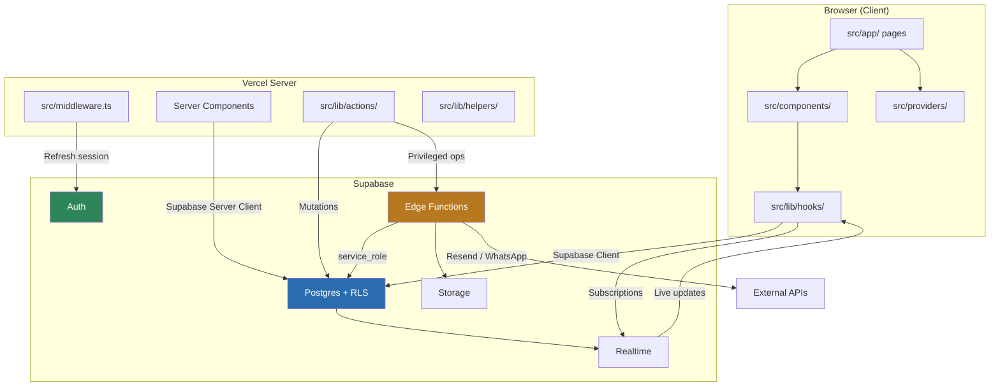

# Aisle — Codebase & File Structure

## Overview

Aisle is built with **Next.js 14+ (App Router)**, **TypeScript**, and **Supabase** as a multi-tenant Wedding SaaS platform. This document explains every directory and file in the project — what it does, why it exists, and how the pieces connect.

---

## Root-Level File Structure

```
Aisle/
├── .github/workflows/         # CI/CD pipeline definitions
├── Docs/                      # Project documentation (6 topic folders)
├── public/                    # Static assets served by Next.js
├── src/                       # Application source code
├── supabase/                  # Supabase backend (migrations, Edge Functions)
├── tests/                     # Unit, integration, and E2E tests
│
├── .env.example               # Environment variable template
├── .eslintrc.json             # ESLint linting rules
├── .gitignore                 # Git ignore rules
├── next.config.ts             # Next.js configuration
├── package.json               # Dependencies & npm scripts
├── postcss.config.js          # PostCSS (Tailwind CSS pipeline)
├── tailwind.config.ts         # Tailwind design tokens & theme
└── tsconfig.json              # TypeScript compiler settings
```

---

## Root Config Files Explained

### `package.json`

The project manifest. Defines all dependencies and runnable scripts.

| Script | Command | Purpose |
|---|---|---|
| `dev` | `next dev` | Start local development server on `localhost:3000` |
| `build` | `next build` | Compile production bundle |
| `lint` | `eslint . --ext .ts,.tsx` | Check code quality |
| `type-check` | `tsc --noEmit` | Verify TypeScript types without emitting |
| `test` | `vitest` | Run unit/integration tests |
| `test:e2e` | `playwright test` | Run browser-based E2E tests |
| `db:gen-types` | `supabase gen types ...` | Auto-generate TypeScript types from DB schema |
| `db:migrate` | `supabase db push` | Push schema migrations to Supabase |

**Key dependencies:**
- `@supabase/ssr` + `@supabase/supabase-js` — Supabase client for server/client rendering
- `next` / `react` / `react-dom` — Core framework
- `tailwind-merge` + `clsx` — Utility for conditional class merging
- `zod` — Runtime schema validation for forms and API payloads

---

### `tsconfig.json`

TypeScript configuration with a **path alias**: `@/*` maps to `./src/*`, so imports look like:

```typescript
import { Button } from "@/components/ui/Button";   // instead of ../../components/ui/Button
```

---

### `next.config.ts`

Configures Next.js image optimization to allow remote images from Supabase Storage (`*.supabase.co`).

---

### `tailwind.config.ts`

Defines the **design system**:
- **Custom fonts**: `Playfair Display` (headings), `Inter` (body), `Great Vibes` (accent/cursive)
- **Brand colors**: Dusty Rose primary (`#B76E79`), Dark Slate secondary (`#2C3E50`), Gold accent (`#D4AF37`)
- **Custom animations**: `fadeInUp`, `slideInRight` for micro-interactions
- **Dark mode**: Class-based strategy (`darkMode: "class"`)

---

### `.env.example`

Template for required environment variables. Developers copy this to `.env.local`:

| Variable | Where Used | Security |
|---|---|---|
| `NEXT_PUBLIC_SUPABASE_URL` | Client + Server | Public — safe to expose |
| `NEXT_PUBLIC_SUPABASE_ANON_KEY` | Client | Public — RLS-scoped |
| `SUPABASE_SERVICE_ROLE_KEY` | Edge Functions only | **Secret — never expose to client** |
| `RESEND_API_KEY` | Edge Functions | Secret |
| `WHATSAPP_*` | Edge Functions | Secret — WhatsApp Business API credentials |
| `SENTRY_DSN` | Client + Server | Monitoring endpoint |

---

## `src/` — Application Source Code

This is the heart of the codebase. Everything a developer works on daily lives here.

```
src/
├── app/             # Pages & routing (Next.js App Router)
├── components/      # Reusable React components
├── lib/             # Shared utilities, hooks, and server logic
├── types/           # TypeScript type definitions
├── providers/       # React context providers
└── middleware.ts    # Auth session refresh on every request
```

---

### `src/middleware.ts`

**What it does**: Intercepts every HTTP request before it reaches a page. It creates a Supabase server client and calls `auth.getUser()` to **refresh the JWT session**. This prevents expired tokens from causing unexpected logouts.

**Why it matters**: Without this, a user's session could silently expire while they're browsing. The middleware keeps the auth cookie fresh transparently.

**Route matching**: Runs on all paths except static assets (`_next/static`, `_next/image`, `favicon.ico`, `images/`, `fonts/`).

---

### `src/app/` — Pages & Routing

Next.js App Router uses **file-system routing** — the folder structure directly maps to URL paths.

```
src/app/
├── layout.tsx              → Root layout (wraps ALL pages)
├── page.tsx                → /                   (public landing page)
├── globals.css             → Global styles + design tokens
│
├── login/
│   └── page.tsx            → /login              (universal login)
│
├── create-event/
│   └── page.tsx            → /create-event       (admin: new wedding wizard)
│
├── weddings/
│   └── page.tsx            → /weddings           (user's wedding list)
│
├── w/[slug]/               → /w/sarah-and-james  (dynamic wedding routes)
│   ├── layout.tsx          → Wedding-scoped layout (nav + theme injection)
│   ├── page.tsx            → Wedding micro-landing page
│   ├── login/page.tsx      → /w/[slug]/login     (wedding-scoped login)
│   ├── story/page.tsx      → /w/[slug]/story     (love story)
│   ├── venue/page.tsx      → /w/[slug]/venue     (venue & details)
│   ├── gallery/page.tsx    → /w/[slug]/gallery   (photo gallery + upload)
│   ├── notes/page.tsx      → /w/[slug]/notes     (guestbook)
│   └── moderate/page.tsx   → /w/[slug]/moderate  (moderator console)
│
└── admin/                  → /admin              (platform admin console)
    ├── layout.tsx          → Admin layout with sidebar
    ├── page.tsx            → Admin dashboard
    └── weddings/[id]/
        └── page.tsx        → /admin/weddings/[id] (admin wedding detail)
```

#### Key Concepts

| Concept | File | Explanation |
|---|---|---|
| **Root Layout** | `layout.tsx` | Wraps every page. Loads fonts, global CSS, and context providers (`AuthProvider`, `ThemeProvider`, `ToastProvider`). Sets SEO metadata defaults. |
| **Dynamic Routes** | `[slug]`, `[id]` | Brackets denote URL parameters. `[slug]` captures the wedding's URL-friendly name; `[id]` captures a wedding UUID. |
| **Nested Layouts** | `w/[slug]/layout.tsx` | Wedding-specific layout that adds the `WeddingNav` component to all wedding sub-pages. Per-wedding theme CSS variables are injected here. |
| **Route Guards** | `AuthGuard` component | Pages like `/create-event`, `/admin`, and `/moderate` wrap content in `<AuthGuard>` to redirect unauthenticated or unauthorized users. **Note**: RLS in Postgres is the real security boundary — route guards are a UX convenience. |

#### `globals.css`

Three Tailwind layers with the full design system:

- **`@layer base`** — CSS custom properties (color tokens, wedding theme overrides), base typography, dark mode variables
- **`@layer components`** — Reusable component classes: `.btn-primary`, `.btn-secondary`, `.card`, `.input-field`, `.section-heading`
- **`@layer utilities`** — Staggered animation utility (`.animate-stagger`) and `prefers-reduced-motion` accessibility support

---

### `src/components/` — Reusable Components

Components are organized by **domain** (what they're for), not by technical type:

```
src/components/
├── ui/            # Design system primitives (domain-agnostic)
├── layout/        # Structural / page skeleton components
├── wedding/       # Wedding micro-site components
├── admin/         # Admin console components (not yet scaffolded)
├── moderator/     # Moderator console components (not yet scaffolded)
├── auth/          # Authentication components (not yet scaffolded)
└── landing/       # Public landing page sections (not yet scaffolded)
```

#### `ui/` — Design System Primitives

These are the building blocks used everywhere. They have no business logic — only presentation and interaction.

| Component | File | Purpose |
|---|---|---|
| **Button** | `Button.tsx` | 5 variants (`primary`, `secondary`, `accent`, `ghost`, `danger`), 3 sizes, loading state with spinner |
| **Input** | `Input.tsx` | Text input with label and error message support |
| **Textarea** | `Textarea.tsx` | Multi-line input with label and error message |
| **Select** | `Select.tsx` | Dropdown select with label and error message |
| **Card** | `Card.tsx` | Card container with `CardHeader`, `CardTitle`, `CardContent` sub-components |
| **Modal** | `Modal.tsx` | Dialog overlay with backdrop blur, escape key dismiss, scroll lock, animations |
| **Badge** | `Badge.tsx` | Semantic color badges (`success`, `warning`, `error`, `info`, `default`) |
| **Avatar** | `Avatar.tsx` | Profile image or initials fallback, 3 sizes |
| **Spinner** | `Spinner.tsx` | SVG loading animation |
| **Toast** | `Toast.tsx` | Notification banner with type variants and dismiss button |
| **Skeleton** | `Skeleton.tsx` | Pulse-animated placeholder for loading states |

All UI components use the `cn()` utility (from `lib/utils/cn.ts`) to merge Tailwind classes cleanly.

#### `layout/` — Page Structure

| Component | File | Purpose |
|---|---|---|
| **Header** | `Header.tsx` | Sticky top nav with logo, navigation links, and auth buttons. Glassmorphism effect (`bg-white/80 backdrop-blur-md`). |
| **Footer** | `Footer.tsx` | Three-column footer with branding, product links, and legal links |
| **Sidebar** | `Sidebar.tsx` | Admin console sidebar with active-state highlighting using `usePathname()` |
| **Container** | `Container.tsx` | Max-width wrapper with 5 size presets (`sm` through `full`) |
| **PageShell** | `PageShell.tsx` | Combines Header + main content + Footer in a flex column |
| **Navbar** | `Navbar.tsx` | Generic horizontal nav with active-route detection |

#### `wedding/` — Wedding Micro-Site Components

These power the wedding pages under `/w/[slug]/`:

| Component | File | Purpose |
|---|---|---|
| **WeddingHero** | `WeddingHero.tsx` | Full-height hero with couple names in cursive, event date, and optional background image |
| **LoveStorySection** | `LoveStorySection.tsx` | Alternating text/image layout (odd sections flip direction) for the love story narrative |
| **VenueCard** | `VenueCard.tsx` | Venue name, address, and map link in a card layout |
| **VenueMap** | `VenueMap.tsx` | Google Maps iframe embed using lat/lng coordinates |
| **WeddingDetailsList** | `WeddingDetailsList.tsx` | Key-value list (dress code, ceremony time, etc.) in a definition list layout |
| **PhotoGrid** | `PhotoGrid.tsx` | Masonry-style column layout with staggered fade-in animations. Placeholder state for empty galleries. |
| **PhotoCard** | `PhotoCard.tsx` | Individual photo tile with caption overlay and hover shadow |
| **PhotoUploader** | `PhotoUploader.tsx` | Upload button that triggers a hidden file input. Accepts multiple images. |
| **PhotoLightbox** | `PhotoLightbox.tsx` | Full-screen image overlay with close button |
| **GuestbookEntry** | `GuestbookEntry.tsx` | Note card with author avatar, name, message, and timestamp |

---

### `src/lib/` — Shared Utilities & Logic

```
src/lib/
├── supabase/        # Supabase client factories
├── utils/           # Pure utility functions
├── hooks/           # Custom React hooks
├── actions/         # Next.js Server Actions
└── helpers/         # Server-side helper functions
```

| Directory | Purpose | Key Files (planned) |
|---|---|---|
| `supabase/` | Create correctly configured Supabase clients for different contexts | `client.ts` (browser), `server.ts` (Server Components), `middleware.ts` (middleware helper), `admin.ts` (service-role for Edge Functions) |
| `utils/` | Pure, stateless utility functions with no side effects | `cn.ts` (class merge), `formatDate.ts`, `slugify.ts`, `validators.ts` (Zod schemas), `constants.ts` |
| `hooks/` | Custom React hooks for client-side state and subscriptions | `useAuth.ts`, `useWedding.ts`, `useRealtime.ts`, `useRole.ts`, `usePhotos.ts`, `useToast.ts` |
| `actions/` | Next.js Server Actions — server-side functions callable from client components | `wedding.actions.ts`, `photo.actions.ts`, `note.actions.ts`, `invite.actions.ts`, `auth.actions.ts` |
| `helpers/` | Server-only helpers shared across Server Components and API routes | `getSessionAndRole.ts` (auth + role resolver), `errorHandler.ts`, `rateLimit.ts` |

---

### `src/types/` — TypeScript Types

| File (planned) | Purpose |
|---|---|
| `database.types.ts` | **Auto-generated** from Supabase schema via `npm run db:gen-types`. Contains typed interfaces for every table, view, and function. Never edit manually. |
| `wedding.types.ts` | Application-level wedding types (e.g., `Photo`, `Note`, `WeddingMembership`) |
| `auth.types.ts` | Auth and role types (`UserRole`, `SessionWithRole`) |
| `api.types.ts` | Request/response types for Edge Function calls |

---

### `src/providers/` — React Context Providers

Providers wrap the app in `layout.tsx` and supply shared state via React Context:

| Provider (planned) | Purpose |
|---|---|
| `AuthProvider.tsx` | Supabase auth state — current user, session, sign-out method |
| `ThemeProvider.tsx` | Dark mode toggle + per-wedding accent color injection |
| `ToastProvider.tsx` | Global toast notification queue with auto-dismiss |
| `RealtimeProvider.tsx` | Supabase Realtime channel subscriptions for live updates |

---

## `supabase/` — Backend Infrastructure

```
supabase/
├── migrations/                 # Ordered SQL migration files
│   ├── 00001_create_profiles.sql
│   ├── 00002_create_weddings.sql
│   ├── 00003_create_memberships.sql
│   ├── 00004_create_love_story.sql
│   ├── 00005_create_venues.sql
│   ├── 00006_create_wedding_details.sql
│   ├── 00007_create_photos.sql
│   ├── 00008_create_notes.sql
│   ├── 00009_create_invites.sql
│   ├── 00010_create_activity_log.sql
│   ├── 00011_create_rls_helpers.sql
│   ├── 00012_enable_rls_policies.sql
│   └── 00013_create_indexes.sql
│
├── functions/                  # Supabase Edge Functions (Deno/TypeScript)
│   ├── create-wedding/         # Admin creates a wedding with all data
│   │   └── index.ts
│   ├── invite-guest/           # Generate invite token + send email/WhatsApp
│   │   └── index.ts
│   ├── process-photo-upload/   # Validate membership, store file, create DB row
│   │   └── index.ts
│   ├── moderate-content/       # Approve/reject photos and notes
│   │   └── index.ts
│   └── send-notifications/     # Dispatch email and WhatsApp messages
│       └── index.ts
│
└── seed.sql                    # Development seed data
```

### Migrations

Migrations run **in order** (numbered `00001` through `00013`). They are idempotent SQL scripts managed by the Supabase CLI. The sequence:

1. **Tables first** (`00001` – `00010`) — Each migration creates one table with columns, constraints, and foreign keys
2. **RLS helpers** (`00011`) — Creates the `membership_role()` and `is_platform_admin()` helper functions
3. **RLS policies** (`00012`) — Enables Row-Level Security and attaches SELECT/INSERT/UPDATE/DELETE policies to every tenant-scoped table
4. **Indexes** (`00013`) — Creates performance indexes for common query patterns

### Edge Functions

Edge Functions are the **server-side logic layer**. They run in Deno on Supabase's edge infrastructure and are the only place the `SERVICE_ROLE_KEY` is used (bypassing RLS for privileged operations).

| Function | Trigger | Why Edge Function? |
|---|---|---|
| `create-wedding` | Admin submits wizard | Needs to insert into multiple tables atomically with service-role privileges |
| `invite-guest` | Moderator sends invite | Generates secure token + calls external email/WhatsApp API |
| `process-photo-upload` | Guest uploads photo | Validates membership server-side, stores file, creates DB row in a single transaction |
| `moderate-content` | Moderator approves/rejects | Updates status + writes audit log in one privileged operation |
| `send-notifications` | Various event triggers | Calls Resend (email) and WhatsApp Business API — external credentials must stay server-side |

---

## `tests/` — Test Suite

```
tests/
├── unit/              # Fast, isolated tests
│   ├── utils/         # Utility function tests (slugify, formatDate, validators)
│   └── components/    # Component rendering tests (Button, PhotoGrid)
│
├── integration/       # Tests crossing boundaries (auth flows, DB operations)
│
└── e2e/               # Full browser tests via Playwright
                       # (landing page, create event, guest flow, moderator flow)
```

| Type | Runner | Speed | What it tests |
|---|---|---|---|
| **Unit** | Vitest | ~ms | Pure functions, component rendering, props/state |
| **Integration** | Vitest | ~seconds | Supabase client calls, server actions, RLS behavior |
| **E2E** | Playwright | ~seconds | Full user journeys in a real browser (Chrome, Firefox, Mobile Chrome) |

---

## `public/` — Static Assets

```
public/
├── images/            # Logo, hero images, OG preview, placeholders
├── fonts/             # Self-hosted font files (if any)
├── favicon.ico
└── robots.txt
```

Files in `public/` are served at the root URL: `public/images/logo.svg` → `https://aisle.app/images/logo.svg`.

---

## `.github/workflows/` — CI/CD

Pipeline definitions for GitHub Actions (to be configured):

- **`ci.yml`** — Runs on every PR: lint, type-check, unit tests
- **`deploy.yml`** — Runs on merge to `main`: build + deploy to Vercel, push DB migrations

---

## Docs/ — Project Documentation

```
Docs/
├── Backend Architecture/      # Supabase services, Edge Functions, security model
├── Business Description/      # Vision, pricing, roadmap, KPIs
├── Codebase and File Structure/ # This document — explains every file and directory
├── Database Schema/           # ER diagrams, table definitions, RLS policies
├── Frontend Style/            # Design system, components, theming, accessibility
├── Project Document/          # Full file tree reference + env vars + scripts
└── Use Case Diagram/          # Actor diagrams, use case tables, sequence diagrams
```

---

## How the Pieces Connect



### Data Flow Summary

1. **User opens a page** → `middleware.ts` refreshes auth session → page loads
2. **Server Component renders** → uses `lib/supabase/server.ts` to fetch data from Postgres (RLS-enforced)
3. **Client Component mounts** → subscribes to Realtime via hooks for live updates (photos, notes)
4. **User performs action** (upload, post, moderate) → calls a Server Action → which either writes directly to Postgres or invokes an Edge Function for privileged operations
5. **Edge Function** uses `SERVICE_ROLE_KEY` to bypass RLS, perform multi-table writes, call external APIs (Resend, WhatsApp), and return results
6. **Postgres CDC** broadcasts changes via Realtime → subscribed clients update their UI automatically
