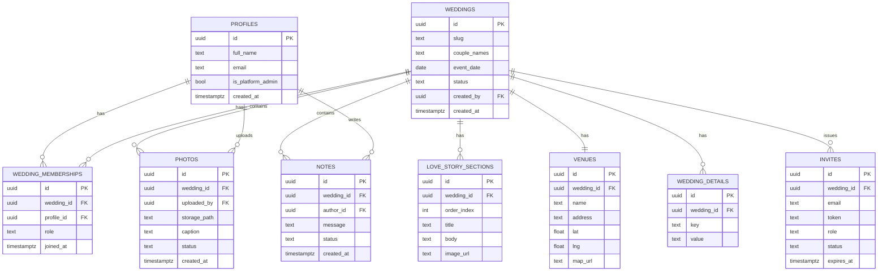

# Aisle — Database Schema Documentation

## Overview

Aisle uses a **shared database, shared schema** multi-tenancy model powered by **Supabase Postgres** with **Row-Level Security (RLS)**.

Every tenant-scoped table carries a `wedding_id` foreign key. Tenant isolation is enforced at the database level via RLS policies — application code never needs manual filtering.

```
Tenant boundary = wedding_id
```

---

## Entity-Relationship Diagram



---

## Table Definitions

### `profiles`

Stores user accounts. Linked to Supabase Auth (`auth.users`). Platform admins are flagged here.

| Column | Type | Constraints | Description |
|---|---|---|---|
| `id` | `uuid` | PK, references `auth.users(id)` | User's unique identifier |
| `full_name` | `text` | NOT NULL | Display name |
| `email` | `text` | UNIQUE, NOT NULL | User email |
| `is_platform_admin` | `boolean` | DEFAULT false | Global admin flag |
| `created_at` | `timestamptz` | DEFAULT now() | Account creation timestamp |

---

### `weddings`

Each row represents a single wedding (tenant).

| Column | Type | Constraints | Description |
|---|---|---|---|
| `id` | `uuid` | PK, DEFAULT gen_random_uuid() | Wedding's unique identifier |
| `slug` | `text` | UNIQUE, NOT NULL | URL-friendly identifier for the wedding micro-site |
| `couple_names` | `text` | NOT NULL | Display names of the couple |
| `event_date` | `date` | | Date of the wedding event |
| `status` | `text` | DEFAULT 'active', CHECK (status IN ('draft','active','suspended','archived')) | Wedding lifecycle status |
| `created_by` | `uuid` | FK → profiles(id) | Admin who created this wedding |
| `created_at` | `timestamptz` | DEFAULT now() | Creation timestamp |

---

### `wedding_memberships`

Join table linking users to weddings with a specific role. This is the core of tenant access control.

| Column | Type | Constraints | Description |
|---|---|---|---|
| `id` | `uuid` | PK, DEFAULT gen_random_uuid() | Membership ID |
| `wedding_id` | `uuid` | FK → weddings(id), NOT NULL | The wedding tenant |
| `profile_id` | `uuid` | FK → profiles(id), NOT NULL | The user |
| `role` | `text` | NOT NULL, CHECK (role IN ('moderator','attendee')) | Role within this wedding |
| `joined_at` | `timestamptz` | DEFAULT now() | When the user joined |

> **Unique constraint:** `(wedding_id, profile_id)` — a user can only have one role per wedding.

---

### `love_story_sections`

Ordered content blocks for the couple's love story page.

| Column | Type | Constraints | Description |
|---|---|---|---|
| `id` | `uuid` | PK | Section ID |
| `wedding_id` | `uuid` | FK → weddings(id), NOT NULL | Parent wedding |
| `order_index` | `integer` | NOT NULL | Display order |
| `title` | `text` | | Section heading |
| `body` | `text` | | Section content (markdown or rich text) |
| `image_url` | `text` | | Optional image for this section |

---

### `venues`

One venue per wedding (1:1 relationship).

| Column | Type | Constraints | Description |
|---|---|---|---|
| `id` | `uuid` | PK | Venue ID |
| `wedding_id` | `uuid` | FK → weddings(id), UNIQUE, NOT NULL | Parent wedding |
| `name` | `text` | NOT NULL | Venue name |
| `address` | `text` | | Full address |
| `lat` | `float` | | Latitude for map pin |
| `lng` | `float` | | Longitude for map pin |
| `map_url` | `text` | | Link to Google Maps or embed URL |

---

### `wedding_details`

Flexible key-value pairs for wedding-specific information (dress code, schedule, dietary info, etc.).

| Column | Type | Constraints | Description |
|---|---|---|---|
| `id` | `uuid` | PK | Detail ID |
| `wedding_id` | `uuid` | FK → weddings(id), NOT NULL | Parent wedding |
| `key` | `text` | NOT NULL | Detail label (e.g., "Dress Code") |
| `value` | `text` | | Detail content |

---

### `photos`

Guest and moderator uploaded photos with moderation status.

| Column | Type | Constraints | Description |
|---|---|---|---|
| `id` | `uuid` | PK | Photo ID |
| `wedding_id` | `uuid` | FK → weddings(id), NOT NULL | Parent wedding |
| `uploaded_by` | `uuid` | FK → profiles(id), NOT NULL | Uploader |
| `storage_path` | `text` | NOT NULL | Path in Supabase Storage (`photos/{wedding_id}/{uuid}.jpg`) |
| `caption` | `text` | | Optional caption |
| `status` | `text` | DEFAULT 'pending', CHECK (status IN ('pending','approved','hidden','deleted')) | Moderation status |
| `created_at` | `timestamptz` | DEFAULT now() | Upload timestamp |

---

### `notes`

Guestbook messages and notes from attendees.

| Column | Type | Constraints | Description |
|---|---|---|---|
| `id` | `uuid` | PK | Note ID |
| `wedding_id` | `uuid` | FK → weddings(id), NOT NULL | Parent wedding |
| `author_id` | `uuid` | FK → profiles(id), NOT NULL | Author |
| `message` | `text` | NOT NULL | Note content |
| `status` | `text` | DEFAULT 'approved', CHECK (status IN ('pending','approved','hidden','deleted')) | Moderation status |
| `created_at` | `timestamptz` | DEFAULT now() | Submission timestamp |

---

### `invites`

Single-use, time-limited invitation tokens.

| Column | Type | Constraints | Description |
|---|---|---|---|
| `id` | `uuid` | PK | Invite ID |
| `wedding_id` | `uuid` | FK → weddings(id), NOT NULL | Target wedding |
| `email` | `text` | NOT NULL | Invitee email |
| `token` | `text` | UNIQUE, NOT NULL | Invite token (UUID or secure random) |
| `role` | `text` | NOT NULL, CHECK (role IN ('moderator','attendee')) | Role the invitee will receive |
| `status` | `text` | DEFAULT 'pending', CHECK (status IN ('pending','accepted','expired','revoked')) | Invite lifecycle |
| `expires_at` | `timestamptz` | NOT NULL | Token expiration |

---

### `activity_log` (Audit)

Captures moderator/admin actions for accountability.

| Column | Type | Constraints | Description |
|---|---|---|---|
| `id` | `uuid` | PK | Log entry ID |
| `wedding_id` | `uuid` | FK → weddings(id) | Related wedding (nullable for global actions) |
| `actor_id` | `uuid` | FK → profiles(id), NOT NULL | Who performed the action |
| `action` | `text` | NOT NULL | Action type (e.g., 'approve_photo', 'delete_note', 'role_change') |
| `target_type` | `text` | | Entity type affected |
| `target_id` | `uuid` | | Entity ID affected |
| `metadata` | `jsonb` | | Additional context |
| `created_at` | `timestamptz` | DEFAULT now() | Timestamp |

---

## Row-Level Security (RLS)

### Helper Functions

```sql
-- Returns the current user's role within a specific wedding
CREATE OR REPLACE FUNCTION public.membership_role(_wedding_id uuid)
RETURNS text
LANGUAGE sql STABLE SECURITY DEFINER AS $$
  SELECT role FROM wedding_memberships
  WHERE wedding_id = _wedding_id AND profile_id = auth.uid()
$$;

-- Checks if the current user is a platform admin
CREATE OR REPLACE FUNCTION public.is_platform_admin()
RETURNS boolean
LANGUAGE sql STABLE SECURITY DEFINER AS $$
  SELECT COALESCE(is_platform_admin, false) FROM profiles WHERE id = auth.uid()
$$;
```

### Policy Patterns

All tables follow a consistent RLS pattern:

| Operation | Admin | Moderator (own wedding) | Attendee (own wedding) |
|---|---|---|---|
| **SELECT** | All rows | Own wedding rows | Own wedding rows |
| **INSERT** | Unrestricted | Own wedding | Own wedding, own content |
| **UPDATE** | Unrestricted | Own wedding | Own content only |
| **DELETE** | Unrestricted | Own wedding | Own content only |

### Example: Photos Table Policies

```sql
ALTER TABLE photos ENABLE ROW LEVEL SECURITY;

CREATE POLICY "Members can view their wedding's photos"
ON photos FOR SELECT USING (
  is_platform_admin()
  OR membership_role(wedding_id) IN ('moderator','attendee')
);

CREATE POLICY "Members can upload photos to their wedding"
ON photos FOR INSERT WITH CHECK (
  membership_role(wedding_id) IN ('moderator','attendee')
  AND uploaded_by = auth.uid()
);

CREATE POLICY "Moderators and admins can moderate any photo"
ON photos FOR UPDATE USING (
  is_platform_admin() OR membership_role(wedding_id) = 'moderator'
);

CREATE POLICY "Owners can delete their own photo; moderators any"
ON photos FOR DELETE USING (
  is_platform_admin()
  OR membership_role(wedding_id) = 'moderator'
  OR uploaded_by = auth.uid()
);
```

---

## Storage Structure

```
Supabase Storage
└── wedding-photos (bucket)
    ├── {wedding_id_1}/
    │   ├── {photo_uuid_1}.jpg
    │   ├── {photo_uuid_2}.jpg
    │   └── ...
    ├── {wedding_id_2}/
    │   └── ...
    └── ...
```

Storage RLS mirrors database policies — access is verified via `membership_role()` against the `wedding_id` path prefix.

---

## Indexes (Recommended)

```sql
CREATE INDEX idx_memberships_wedding ON wedding_memberships(wedding_id);
CREATE INDEX idx_memberships_profile ON wedding_memberships(profile_id);
CREATE INDEX idx_memberships_composite ON wedding_memberships(wedding_id, profile_id);
CREATE INDEX idx_photos_wedding ON photos(wedding_id);
CREATE INDEX idx_photos_status ON photos(wedding_id, status);
CREATE INDEX idx_notes_wedding ON notes(wedding_id);
CREATE INDEX idx_invites_token ON invites(token);
CREATE INDEX idx_invites_wedding ON invites(wedding_id);
CREATE INDEX idx_love_story_order ON love_story_sections(wedding_id, order_index);
CREATE INDEX idx_weddings_slug ON weddings(slug);
```
