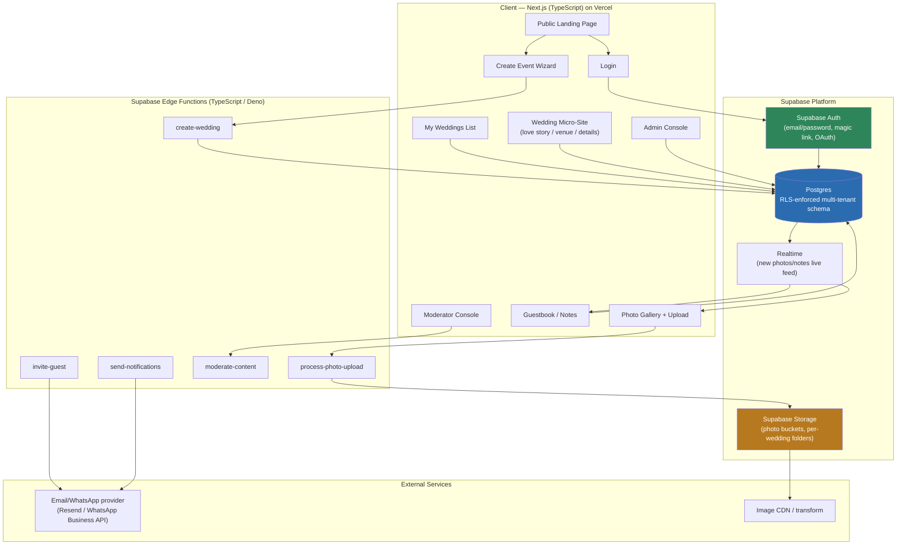
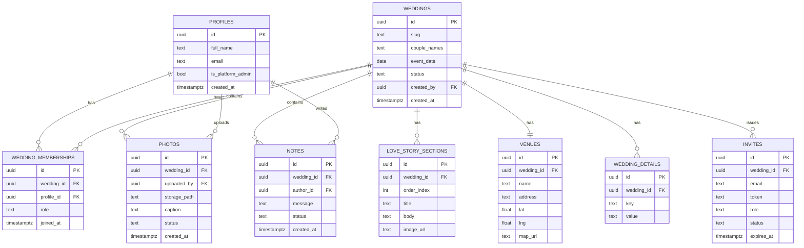
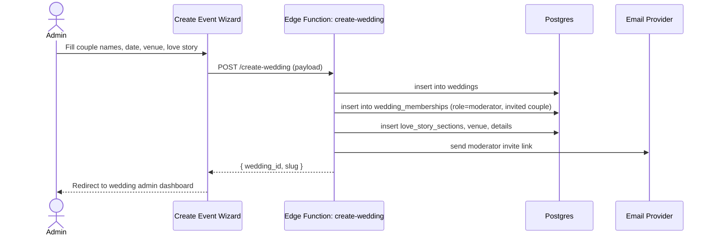
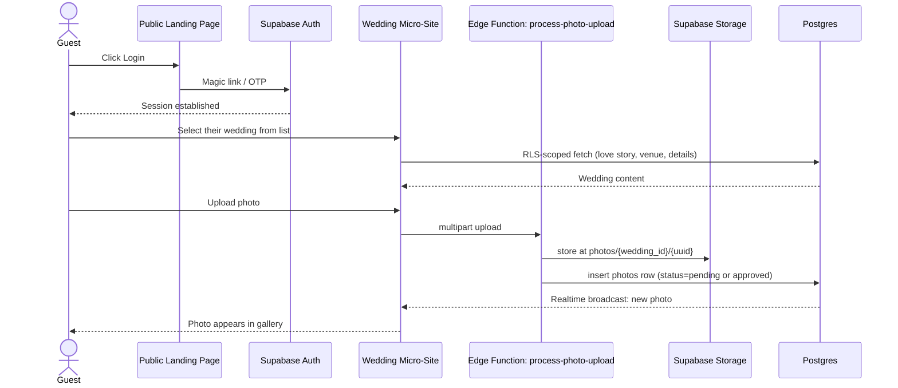
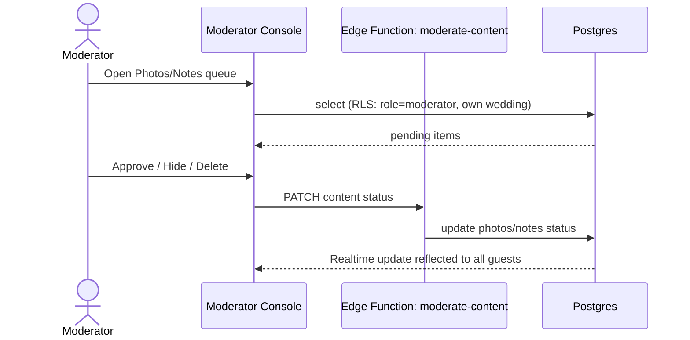

# WedTogether — Multi-Tenant Wedding SaaS
## System Architecture Document

**Stack:** TypeScript · Next.js (App Router) · Supabase (Postgres, Auth, Storage, Realtime, Edge Functions) · Vercel

---

## 1. Product Summary

A multi-tenant platform where each **wedding** is a tenant. The public landing page explains the product and offers two entry points: **Login** and **Create Event**. Three roles interact with the system:

| Role | Scope | Core abilities |
|---|---|---|
| **Admin** | Global (platform) | Create/manage all weddings, manage moderators, view/supervise everything, suspend tenants, billing |
| **Moderator** | Single wedding (tenant) | Moderate all content in their wedding, manage the guest list, edit love story/venue/details, review photos/notes |
| **Attendee (Guest)** | Single wedding (tenant), read + contribute | View wedding site, upload photos, leave notes/guestbook messages |

Each wedding gets its own **mini landing page** (love story, venue, details) with its own login gate for guests.

---

## 2. Tenancy Model

**Approach: Shared database, shared schema, tenant isolation via Row-Level Security (RLS).**

This is the standard Supabase multi-tenancy pattern and fits this product well because:

- Weddings are numerous but individually small (dozens–hundreds of guests) — schema-per-tenant would be massive operational overhead for little benefit.
- Every table that holds tenant data carries a `wedding_id` foreign key.
- Postgres RLS policies scope every query automatically based on the authenticated user's JWT claims and their `wedding_memberships` row — the app code never has to manually filter "just in case."
- Admins bypass tenant scoping via a `service_role`-gated set of policies (`is_platform_admin()`).

```
Tenant boundary = wedding_id
Every row in: weddings, memberships, love_story_sections, venues,
              wedding_details, photos, notes, invites
  → tenant-scoped by wedding_id, enforced by RLS
```

---

## 3. High-Level Architecture Diagram



---

## 4. Roles & Permission Matrix (RLS logic in plain terms)

| Action | Admin | Moderator (own wedding) | Attendee (own wedding) | Anyone (public) |
|---|:---:|:---:|:---:|:---:|
| View landing page | ✅ | ✅ | ✅ | ✅ |
| Create a wedding | ✅ | ❌ | ❌ | ❌ |
| View list of all weddings | ✅ | ❌ (only own) | ❌ (only own) | ❌ |
| Edit love story / venue / details | ✅ | ✅ (own) | ❌ | ❌ |
| Invite / remove guests | ✅ | ✅ (own) | ❌ | ❌ |
| Upload photos | ✅ | ✅ | ✅ (own wedding) | ❌ |
| Delete/hide any photo or note | ✅ | ✅ (own wedding) | own content only | ❌ |
| Post a note/guestbook message | ✅ | ✅ | ✅ | ❌ |
| View guest list & attendee roster | ✅ | ✅ (own) | ❌ | ❌ |
| Suspend/delete a wedding | ✅ | ❌ | ❌ | ❌ |

This maps 1:1 to a `wedding_memberships.role` enum (`admin` is actually platform-level, stored separately as `profiles.is_platform_admin`).

---

## 5. Database Schema



### Key RLS policy patterns (illustrative)

```sql
-- Helper: is the current user a member of a given wedding, and with what role?
create or replace function public.membership_role(_wedding_id uuid)
returns text
language sql stable security definer as $$
  select role from wedding_memberships
  where wedding_id = _wedding_id and profile_id = auth.uid()
$$;

-- Platform admin bypass
create or replace function public.is_platform_admin()
returns boolean
language sql stable security definer as $$
  select coalesce(is_platform_admin, false) from profiles where id = auth.uid()
$$;

-- Example: photos table
alter table photos enable row level security;

create policy "Members can view their wedding's photos"
on photos for select
using (
  is_platform_admin()
  or membership_role(wedding_id) in ('moderator','attendee')
);

create policy "Members can upload photos to their wedding"
on photos for insert
with check (
  membership_role(wedding_id) in ('moderator','attendee')
  and uploaded_by = auth.uid()
);

create policy "Moderators and admins can moderate any photo"
on photos for update using (
  is_platform_admin() or membership_role(wedding_id) = 'moderator'
);

create policy "Owners can delete their own photo; moderators any"
on photos for delete using (
  is_platform_admin()
  or membership_role(wedding_id) = 'moderator'
  or uploaded_by = auth.uid()
);
```

Storage bucket policies mirror this: photos live at `photos/{wedding_id}/{uuid}.jpg`, and Storage RLS checks the same `membership_role()` function against the path prefix.

---

## 6. Core User Flows

### 6.1 Create Event (Admin creates a wedding)



### 6.2 Guest joins and uploads a photo



### 6.3 Moderator moderates content



---

## 7. Application Routing (Next.js App Router)

```
/                                → Public landing page (product marketing)
/login                           → Universal login (role resolved after auth)
/create-event                    → Admin-only: new wedding wizard
/weddings                        → "My Weddings" list (role-aware: admin sees all, guest sees theirs)
/w/[slug]                        → Wedding public micro-landing page (teaser, RSVP/login CTA)
/w/[slug]/login                  → Wedding-scoped login (invite-token or account login)
/w/[slug]/story                  → Love story
/w/[slug]/venue                  → Venue & details
/w/[slug]/gallery                → Photo sharing (upload + view)
/w/[slug]/notes                  → Guestbook / notes
/w/[slug]/moderate               → Moderator console (guarded)
/admin                           → Admin console: all weddings, users, platform settings
/admin/weddings/[id]             → Admin drill-down into a specific wedding
```

Route guards are implemented via a shared `getSessionAndRole(weddingSlug?)` server-side helper that reads the Supabase session, checks `wedding_memberships` (or `is_platform_admin`), and redirects unauthorized users — this is a UX convenience layer; **RLS in Postgres is the real security boundary**, not the route guard.

---

## 8. Tech Stack Detail

| Layer | Choice | Notes |
|---|---|---|
| Frontend framework | Next.js 14+ (App Router), TypeScript | Server Components for data-heavy pages, Client Components for gallery/upload interactivity |
| Styling | Tailwind CSS | Fast to theme per-wedding (accent colors) |
| Auth | Supabase Auth | Email/password + magic link for guests; optional Google OAuth |
| Database | Supabase Postgres | RLS as the tenant boundary |
| File storage | Supabase Storage | Bucket `wedding-photos`, path-scoped by `wedding_id` |
| Realtime | Supabase Realtime (Postgres CDC) | Live gallery/notes updates without polling |
| Backend logic | Supabase Edge Functions (Deno/TS) | Anything needing service-role privileges: invites, moderation side-effects, image processing hooks |
| Image transforms | Supabase Storage image transformation (or a CDN like Cloudflare Images) | Thumbnails for gallery grid |
| Email/WhatsApp | Resend (email) / WhatsApp Business API | Invites, notifications |
| Hosting | Vercel | Next.js-native, preview deployments per PR |
| Monitoring | Sentry + Supabase logs | Error tracking across edge functions and client |

---

## 9. Security Considerations

- **RLS everywhere.** No table is queried by the client without RLS enabled; the anon/client key never bypasses tenant scoping.
- **Service-role key never reaches the client** — only used inside Edge Functions for privileged operations (e.g., admin creating a wedding on behalf of a couple).
- **Invite tokens** are single-use, time-limited, and scoped to a `wedding_id` + `role`, preventing guests from self-escalating to moderator.
- **Photo/content moderation queue** — default `status = pending` for guest-submitted content if the moderator enables approval mode (configurable per wedding).
- **Storage path validation** — Edge Function verifies `wedding_id` membership server-side before issuing a signed upload URL, in addition to Storage RLS.
- **Rate limiting** on photo uploads and note posting per user per wedding (Edge Function + Postgres counter) to prevent spam.
- **Audit log table** (`activity_log`) capturing moderator/admin actions (approve, delete, role change) for accountability.

---

## 10. Multi-Tenancy Alternatives Considered

| Option | Verdict |
|---|---|
| **Schema-per-tenant** | Rejected — hundreds/thousands of weddings would mean thousands of schemas; migrations become unmanageable |
| **Database-per-tenant** | Rejected — massive operational overhead for a low-data-volume tenant type (a wedding isn't enterprise-scale) |
| **Shared schema + RLS** (chosen) | Fits Supabase natively, scales to many small tenants, single migration path, admin cross-tenant queries stay simple |

---

## 11. Suggested Build Phases

1. **Foundation** — Supabase project, schema + RLS, Auth, Next.js skeleton, public landing page
2. **Admin core** — Create Event wizard, Weddings list, Admin console
3. **Wedding micro-site** — Love story, venue, details (moderator CMS + public view)
4. **Guest features** — Wedding login, photo gallery + upload, notes/guestbook, Realtime feed
5. **Moderation tools** — Moderator console, approval queue, guest roster management, invites
6. **Polish** — Notifications (email/WhatsApp), per-wedding theming, image optimization, audit log, analytics for admin

---

*Document version 1.0 — generated as a starting architecture; adjust role names, tenancy granularity, and storage provider as requirements firm up.*