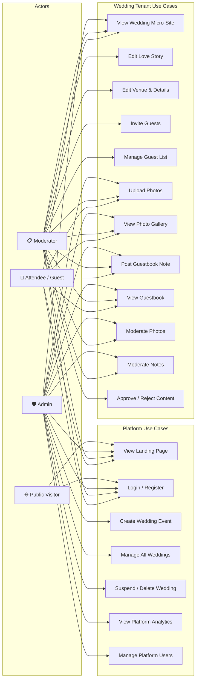
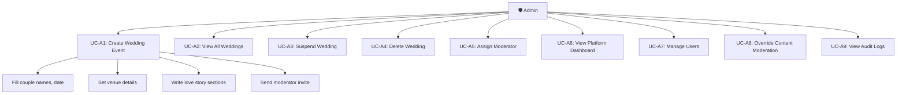
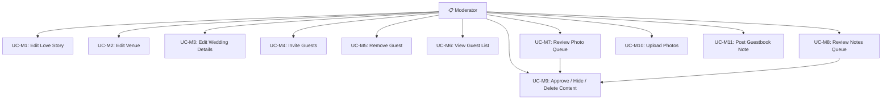
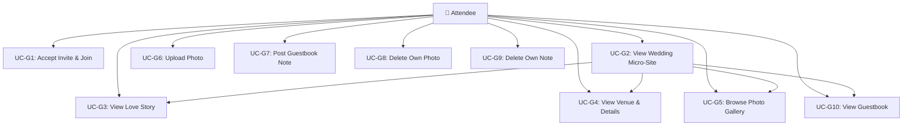
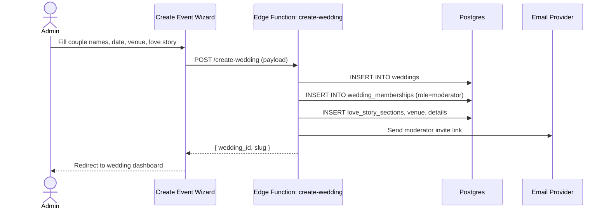
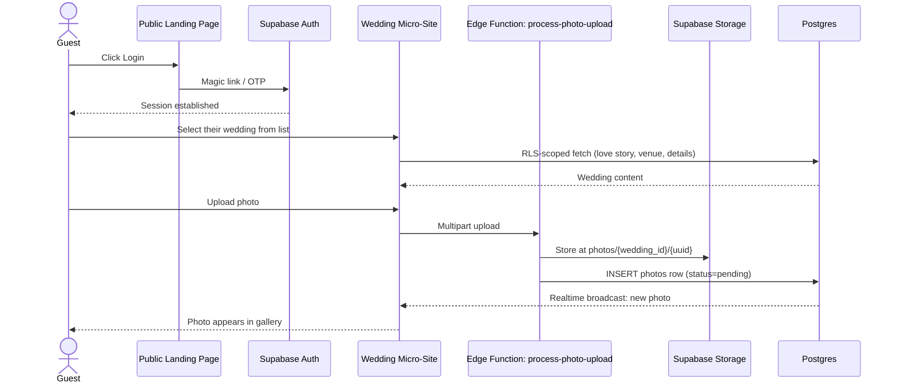
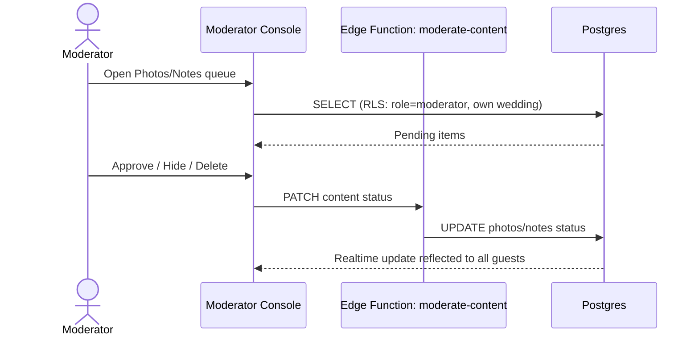

# Aisle — Use Case Diagrams

## Overview

Aisle has three actor roles that interact with the system:

| Role | Scope | Description |
|---|---|---|
| **Admin** | Global (platform) | Creates/manages all weddings, manages moderators, full platform oversight |
| **Moderator** | Single wedding (tenant) | Moderates content, manages guest list, edits wedding details |
| **Attendee (Guest)** | Single wedding (tenant) | Views wedding site, uploads photos, leaves notes/guestbook messages |

---

## System Use Case Diagram

---

## Use Cases by Actor

### 🛡️ Admin Use Cases

| UC ID | Use Case | Description | Precondition | Postcondition |
|---|---|---|---|---|
| UC-A1 | Create Wedding Event | Admin fills a wizard with couple names, date, venue, love story sections | Admin is authenticated | Wedding created, moderator invite sent |
| UC-A2 | View All Weddings | Admin sees a list of all weddings across the platform | Admin is authenticated | List of weddings rendered |
| UC-A3 | Suspend Wedding | Admin changes a wedding status to 'suspended' | Wedding exists and is active | Wedding becomes inaccessible to guests |
| UC-A4 | Delete Wedding | Admin permanently removes a wedding and its data | Wedding exists | All wedding data purged |
| UC-A5 | Assign Moderator | Admin sends a moderator invite to a user for a specific wedding | Wedding exists | Invite token generated and emailed |
| UC-A6 | View Platform Dashboard | Admin views platform-wide analytics and metrics | Admin is authenticated | Dashboard rendered |
| UC-A7 | Manage Users | Admin views/edits platform users, can revoke access | Admin is authenticated | User records updated |
| UC-A8 | Override Content Moderation | Admin can approve/reject/delete any content on the platform | Content exists | Content status updated |
| UC-A9 | View Audit Logs | Admin reviews the activity_log for accountability | Admin is authenticated | Audit entries displayed |

---

### 📋 Moderator Use Cases

| UC ID | Use Case | Description | Precondition | Postcondition |
|---|---|---|---|---|
| UC-M1 | Edit Love Story | Moderator adds/edits/reorders love story sections | Moderator is a member of the wedding | Love story updated |
| UC-M2 | Edit Venue | Moderator updates venue name, address, map coordinates | Moderator is a member of the wedding | Venue info updated |
| UC-M3 | Edit Wedding Details | Moderator manages key-value detail entries (dress code, schedule, etc.) | Moderator is a member of the wedding | Details updated |
| UC-M4 | Invite Guests | Moderator sends invite emails with unique tokens | Moderator is a member of the wedding | Invite tokens created, emails sent |
| UC-M5 | Remove Guest | Moderator removes a guest's membership | Guest is a member | Membership row deleted |
| UC-M6 | View Guest List | Moderator sees all guests and their RSVP/join status | Moderator is a member of the wedding | Guest list rendered |
| UC-M7 | Review Photo Queue | Moderator views pending photos awaiting approval | Photos exist with status='pending' | Queue rendered |
| UC-M8 | Review Notes Queue | Moderator views pending guestbook notes | Notes exist with status='pending' | Queue rendered |
| UC-M9 | Approve / Hide / Delete Content | Moderator changes status of photos or notes | Content exists in own wedding | Content status updated, reflected in real-time |
| UC-M10 | Upload Photos | Moderator uploads photos to the wedding gallery | Moderator is a member | Photo stored, row created |
| UC-M11 | Post Guestbook Note | Moderator posts a note to the guestbook | Moderator is a member | Note created |

---

### 👤 Attendee (Guest) Use Cases

| UC ID | Use Case | Description | Precondition | Postcondition |
|---|---|---|---|---|
| UC-G1 | Accept Invite & Join | Guest clicks invite link, creates account or logs in, joins wedding | Valid invite token | Membership created, token consumed |
| UC-G2 | View Wedding Micro-Site | Guest sees the wedding's landing page with couple info | Guest is a member | Micro-site rendered |
| UC-G3 | View Love Story | Guest reads the love story sections | Guest is a member | Love story rendered |
| UC-G4 | View Venue & Details | Guest sees venue info and wedding details | Guest is a member | Venue/details rendered |
| UC-G5 | Browse Photo Gallery | Guest views approved photos in a gallery grid | Guest is a member | Gallery rendered (real-time updates) |
| UC-G6 | Upload Photo | Guest uploads a photo with optional caption | Guest is a member | Photo stored, appears after moderation |
| UC-G7 | Post Guestbook Note | Guest submits a message to the guestbook | Guest is a member | Note created (pending or approved) |
| UC-G8 | Delete Own Photo | Guest deletes a photo they uploaded | Photo exists, uploaded_by = current user | Photo removed |
| UC-G9 | Delete Own Note | Guest deletes a note they authored | Note exists, author_id = current user | Note removed |
| UC-G10 | View Guestbook | Guest reads approved guestbook messages | Guest is a member | Guestbook rendered |

---

## Core Sequence Diagrams

### Flow 1: Create Event (Admin)

### Flow 2: Guest Joins & Uploads Photo

### Flow 3: Moderator Reviews Content

---

## Permissions Matrix

| Action | Admin | Moderator (own wedding) | Attendee (own wedding) | Public |
|---|:---:|:---:|:---:|:---:|
| View landing page | ✅ | ✅ | ✅ | ✅ |
| Create a wedding | ✅ | ❌ | ❌ | ❌ |
| View list of all weddings | ✅ | ❌ (only own) | ❌ (only own) | ❌ |
| Edit love story / venue / details | ✅ | ✅ (own) | ❌ | ❌ |
| Invite / remove guests | ✅ | ✅ (own) | ❌ | ❌ |
| Upload photos | ✅ | ✅ | ✅ (own wedding) | ❌ |
| Delete/hide any photo or note | ✅ | ✅ (own wedding) | Own content only | ❌ |
| Post a guestbook message | ✅ | ✅ | ✅ | ❌ |
| View guest list & roster | ✅ | ✅ (own) | ❌ | ❌ |
| Suspend/delete a wedding | ✅ | ❌ | ❌ | ❌ |
